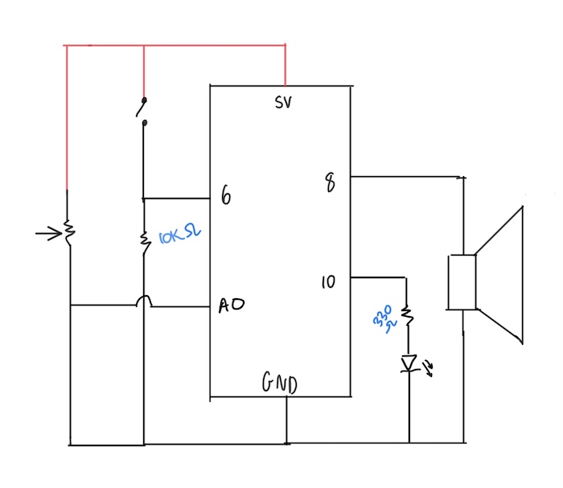

# November 17 Assignment

#### Project Idea & Schematic

My project this week is inspires by radios! At first I had wanted to create a digital keyboard of sorts, that used 3 momentary switches as "piano keys". I felt that it wasn't that hard to do and I wanted to work on something that would challenge me more. My project consists of an on and off toggle switch for the radio, and a potentiometer to control which tunes come on. [Click here](https://drive.google.com/file/d/11WzflGyhwffVQrQ8YXlKiO1M8ObNS52J/view?usp=sharing) for a video of the project.

#### Problems I ran into

The main issue I ran into had to do with the changing tunes. At first I had tried to make the momentary switch work like a toggle switch (so that the light can indicate whether the radio was on or off) and that caused me trouble when it came to changing the songs with the potentiometer. The only way a new song would play was if I pressed the switch to turn it off then on again. I don't know why I didn't just use the toggle switch to begin with, but once I did, the problem was thankfully resolved. 
