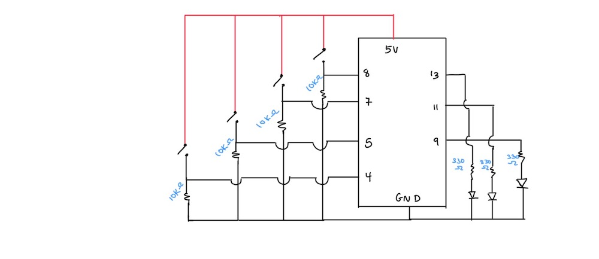
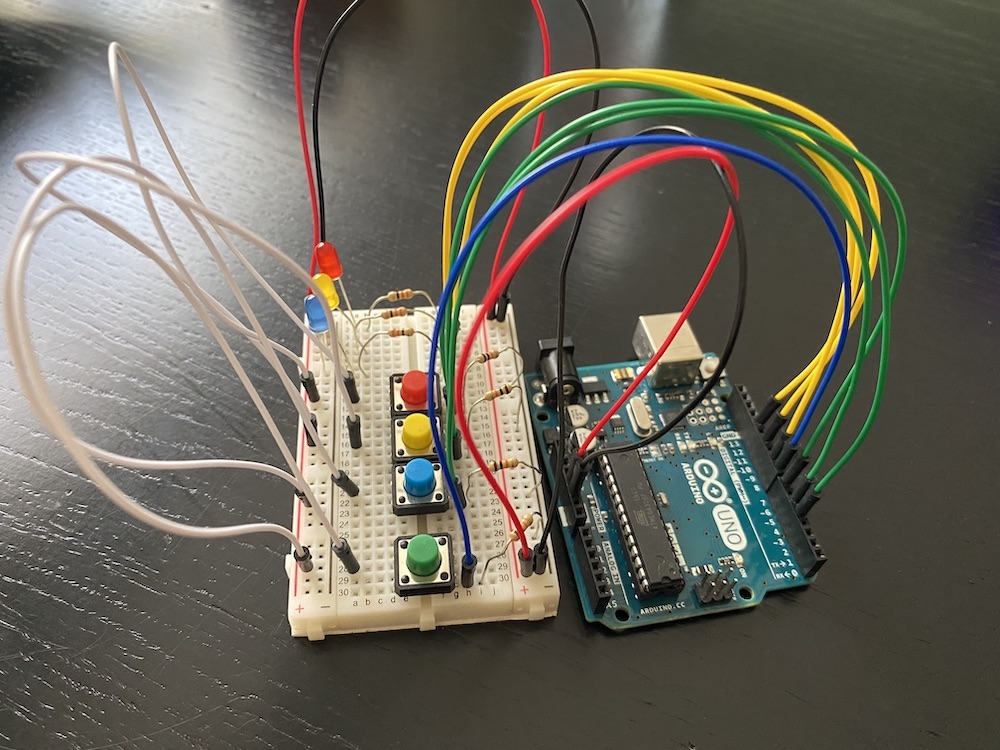

# November 3 Assignment

### Assignment Idea

- The idea of this assignment was to have a light pattern appear, and the task is to press on the buttons (momentary switches) that correspond to the LED lights in color and try to repeat the pattern that was just displayed. 
- I couldn't get the video to upload for some reason, but as I previously explained a pattern would appear and you have to repeat it. As for the green switch, it displays the light pattern again when it is pressed.

### Issues I ran into:

- The main issue I ran into was the power source. I had wanted to use all 4 momentary switches but realized I didn't have enough power sources because I was approaching the whole thing wrong.
- What I did was try to individually connect each switch to a power source which wouldn't have been possible since there are only two power sources: the 5V & the 3.3V
- After realizing my mistake, I looked for a different approach. What I ended up doing was use the power rail to connect to the power source that way I could simply connect my wires through the rail rather than struggling to find a way to connect to a power source.
- That made it way more convenient and allowed it to look more organized since I didn't use as many wires. 
