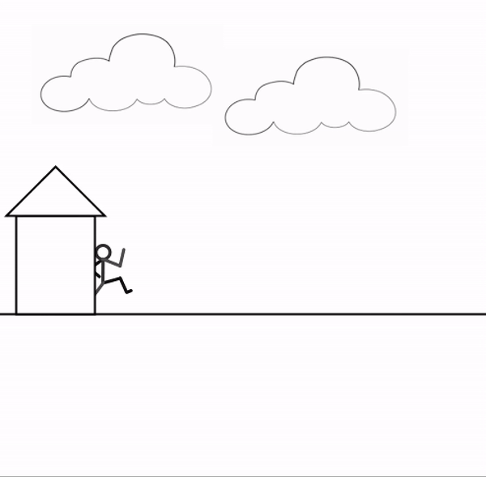

# October 13 Assignment

#### My Process!

Below is a video of my project.

The first thing that came to mind when brainstorming ideas for this week's project was a stickman! My project began with a simple animation of a stickman that moved across the screen when a key was pressed. The code essentially just randomly loaded through an array of stickman images, which then created the illusion of movement. 

I had planned to add a house and a floor and end on that note, but as I was working more ideas came to mind. I didn't want to have a stickman aimlessly running, so I decided to add a cat chasing behind it! Finally, I added some clouds to give it a more lively feeling.

The most difficult part for me was trying to figure out how to load the images in an array because it is still something I struggle with a bit. After watching some videos and using Daniel Shiffman's processing examples as a reference, I was able to figure it out.
