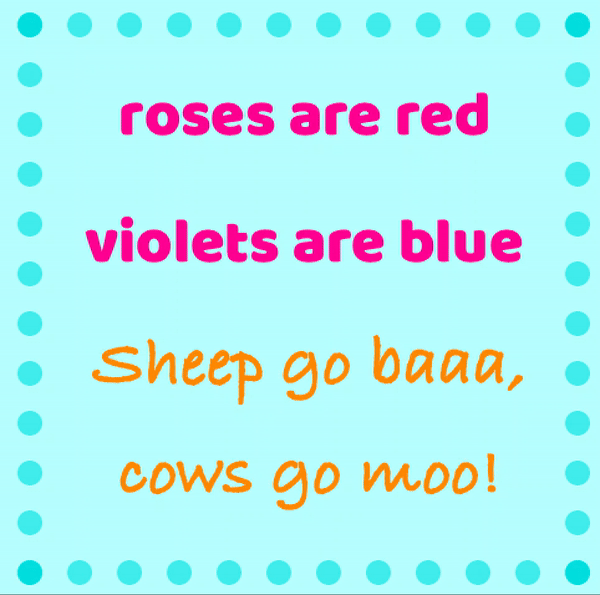

# October 6 Assignment

#### Assignment Comments

My project this week is based off of a rhyme. The whole concept is that the starting two lines "Roses are red, Violets are blue" remain fixed while the continuation is chose randomly from a list of phrases in a csv file.

With this being a new concept to me, what I struggled with the most was how to extract data from my file and implement it into my program. 

