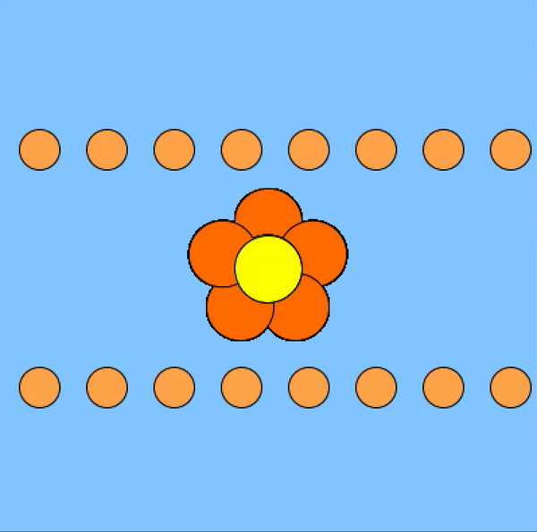

# September 29 Assignment

#### My Process

The whole idea of my project was to have a design revolving around a flower. This is where things got a little confusing to me. Initially, I created a class called flower, and with arrays, I wanted to scatter multiple flowers randomly across the canvas. That proved to be a difficult task because I didn't consider that the flower wasn't a whole entity but rather made of different ellipses. Anytime I tried to introduce a variable so that the whole flower would move together, only pieces of it would. I tried as much as I could to figure out how to make it work until I decided to move on to a slightly modified idea. 

Rather than having scattered flowers, I decided to have moving circles in the background (something that would look somehwat similar to petals falling in the background). In order to do that I needed to have the line of circles as my class. 

