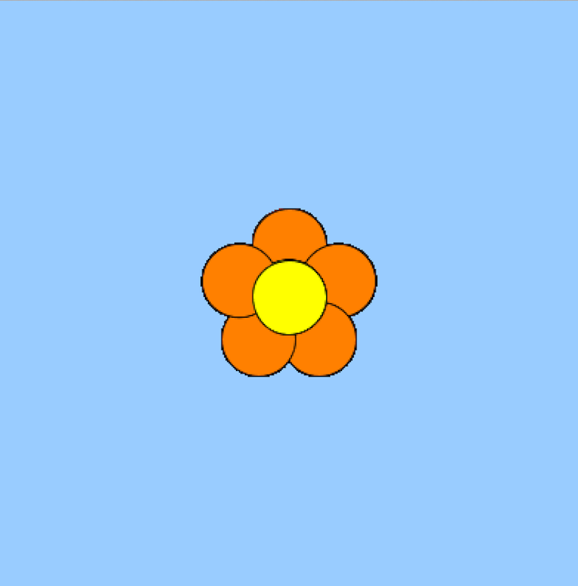

# September 29 Assignment

#### My Process

The first thing I did when beginning to work on a design and I decided to go with a flower. 

This is where things got a little confusing to me. Iitially, I created a class called flower, and with arrays, I wanted to scatter multiple flowers across the canvas. That proved to be a difficult task because I didn't consider that the flower wasn't a whole entity but rather made of different ellipses. Anytime I tried to introduce a variable so that the whole flower would move together, only pieces of it would. I tried as much as I could to figure out how to make it work until I decided to move on to a slightly modified idea. 

