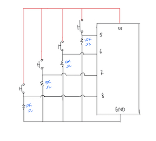
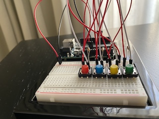
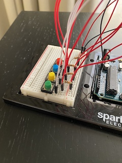
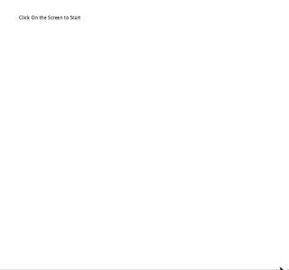
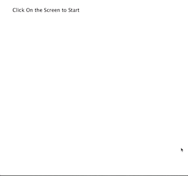
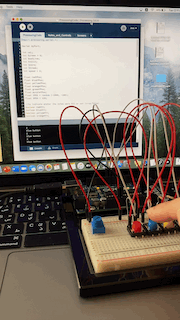
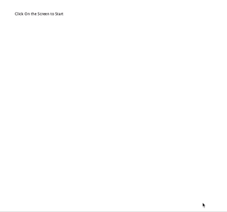
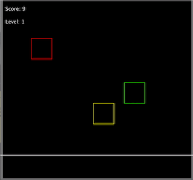
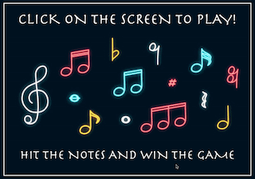

# Final Project

## Project Idea

For my final project I really wanted to do something musical. Just to quickly explain, the whole point of the game is hitting the musical notes when they reach the horizontal line at the bottom of the screen. Your score increases everytime you hit the note and the more notes you get, the faster they move on the screen. The game was inspired by those music learning apps that always pop up as advertisements to youTube videos. The concept is different in terms of the purpose of my game and the idea does differ, but that was where I got the inspiration to do something musical. 

Below are images of my schematic as well as the physical Arduino

  

[Click here](https://drive.google.com/file/d/11Az_ILbjyO3sr4XAodourlsNjHxdMoxv/view?usp=sharing) to see what happens when you win the game!

[Click here](https://drive.google.com/file/d/1o83kbVLAjv9bGUAkooLmdgRasNP2tJl4/view?usp=sharing) to see what happens when you lose the game :(

### Project Progress

Note that any further details on the project can be found on [this page](https://github.com/AalyaSharaf/intro-to-IM/blob/master/finalProject/journal.md)

#### Stage 1
- Since the midterm project, I feel like my understanding of processing has improved and it has become easier to use than it was at the beginning of the year so that was where I decided to start my project.
- The first thing I did was work on creating different game screens to transition between
- After that I worked on the desing of the game, not the aesthetic but rather how the game would generally work.

#### Stage 2
- I worked on the code of the game itself, but focused on making it work only on processing (so using the key pressed function). 

#### Stage 3
- I worked on figuring out the communications between processing and arduino.
- I used a println function, a simple way to figure out whether the buttons pressed in arduino were communicating properly to arduino

#### Stage 4
- My switches weren't doing what I wanted them to (which was take the place of the keys as controls) so I focused mostly on research and searching the web to see if anybody was runnong into similar issues and looking for ways to resolve them.
- To see if the momentary switches were working, I made it so the notes were reset to the top of the screen everytime a switch was pressed.

#### Stage 5
- I figured out that the issues with my switches weren't from processing but from arduino and the way I had written the code over there
- I also added levels which meant that the speed would increase as your score did (to add a bit of challenge to the game)

#### Stage 6
- I didn't work on anything technical and just focused on the aesthetic and design of the game

### Problems I ran into
