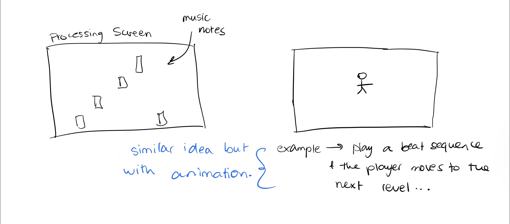

# Project Idea

### *Note that all videos of my project progress will be found in my README page!*

- I dont have the specifics of my project figured out yet, but I know that I want to use arduino to communicate to a game on processing. I want the communication to be both ways so that both arduino and processing are communicating with each other. The controls would be on arduino while feedback from the actual game would be communicated to different things connected to the arduino board. 
- I was thinking of creating a musical instrument of sorts, maybe one that switches between piano and drum notes.
- The first is a simple idea of having to hit the right notes on the processing screen 
-  Another idea is to incorporate the concept of a musical instrument with a simple game design so that the notes control the direction in which a character moves in a game... 

## My Progress

#### November 27, 2020

- What I focused on today is designing my game on processing. 
- I started on figuring out the design I want for each of my screens (home, game, gameover) and then I worked on how to transition between them.
- Next, I worked on my music notes/ tiles, things like their position on the screen and making them appear at random positions.

#### November 28, 2020
- The next thing I worked on is trying to implement the controls and making the game actually work. 
- For today, I worked on making the game work specifically on processing, making sure that if specific keys are pressed it would work. I will work on transitioning into arduino in the coming days.
- I found that the best aproach I could take was to use boolean statements since they can only be true or false. [Daniel Shiffman's tutorials](https://www.youtube.com/watch?v=_NJqfZUQ3i4) were an easy way to better understand the concept and made it easier for me to implement them in my code. 
- I feel like using booleans were tricky for me especially with understanding the meaning of having a true or false statement, so I ran into a lot of dead ends when programming that part of the game.
- Something as simple as having my code equals to true rather than false would completely mess up how the game worked.
- After a lot of trial and error and watching a lot of youtube tutorials, I was able to find the right way to use the boolean statements and was able to code the game in processing. 

#### November 29, 2020
- Today I worked on trying to build a communication between arduino and processing.
- The main thing I did is connecting 4 momentary switches, so that when one of them is pressed, the text appears through the println function.
- I haven't gotten far in terms of communication, just made it so the text would show in processing when a button is pressed (to see whether the communication was working or not)
- I still haven't figured out how to make the switches work in relation to game as I am still trying ot navigate the concept of communication but hopefully I will have it done within the next week. 

#### December 3, 2020
- The past few days I have been looking for different resources that could be helpful in helping me solve my issue with my buttons. 
- I found some [forums](https://forum.processing.org/two/discussion/11076/processing-arduino-buttons) (mostly people trying to debug their code) as well as youTube videos that helped me understand the concept of communications more clearly but I still haven't come up with a way to make my buttons work as controls. 
- To test whether my buttons worked with my notes, I made it so when a button is pressed, the tile corresponding with the button color would reset its y position to 0.
- It did thankfully work so the next step will hopefully be transitioning my processing controls onto the arduino.
- Another adjustement I made was the number of tiles. Initially, I wanted to have 6 tiles that corresponded to 3 buttons, so that each button corresponds to a color, as well as having a combination of 2 buttons that would correspond to another colored tile. I decided to scrap that idea for the time being and figure out the very basics of having one button linked to one color and make sure that works effectively. Once I have figured that out, maybe I can work on bringing back my previous idea (if I have time).

#### December 4, 2020
- On the issue of my switches being used as controls, I realized that I was focusing on the wrong thing. At first I thought the issue may have been from processing, but after seeing that the communication between arduino and processing was working fine on processing's end, I decided to focus on arduino. It turns out that was where my issue was. The way the communication worked between the 2 programs was that each color corresponded to a number on the serial monitor (red = 1, blue = 2, etc...) and I realized that the issue was in the way arduino relayed its information to processing. For example, once the red button was pressed, the serial monitor would continue to display the number for the color red and that was it (even after the button was released). This blocked the other buttons from being recognized in the program. 
- The way I fixed this issue was in the way the if statements were worded & making sure that after the button would be released, the number 0 would be displayed. That was essential in order to make sure that processing could distinguish between the different buttons. 
- In addition to that, I added a speed/ level feature so that everytime you reached a certain score, the level of the game (meaning the speed) increases. I wanted to use the potentiometer to control the speed but when I thought about it, I decided that I didnt want the level of the game to be a manual option but rather a "built-in" feature. 

#### December 5, 2020
- Today I didn't work on anything technical and focused on the design of the game, since it isnt the most aesthetic. 
- I still want to work on the idea of having 6 notes corresponding to 3 buttons. I don't know whether that is possible or not but it is definitely something I want to explore. 

#### December 7, 2020
- The project's due date is coming up and I don't know if I'll be able to finish this in time but I want to add one final thing before the due date.
- I want to incorporate sound into the game. A backtrack will be playing on the processing wndow, but I also want to incorporate the buzzer into arduino for smaller sound effects in the game, like a sound for when the game is won or lost. 
- Anything that I can't finish I will definitely continue to work on even after the due date because I really want to fully complete the project, I feel like it has been a great learning experience for me :)
