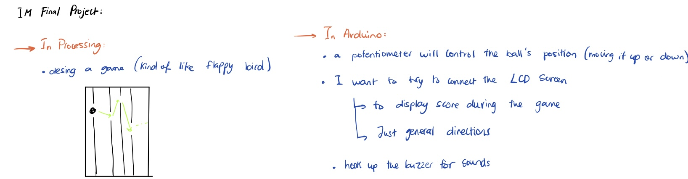

# Project Idea

- I dont have the specifics of my project figured out yet, but I know that I want to use arduino to communicate to a game on processing. I want the communication to be both ways so that both arduino and processing are communicating with each other. The controls would be on arduino while feedback from the actual game would be communicated to different things connected to the arduino board. 
- I was thinking of creating a musical instrument of sorts, maybe one that switches between piano and drum notes.
- The first is a simple idea of having to hit the right notes on the processing screen 
-  Another idea is to incorporate the concept of a musical instrument with a simple game design so that the notes control the direction in which a character moves in a game... 

## My Progress

#### November 27, 2020

- What I focused on today is designing my game on processing. 
- I started on figuring out the design I want for each of my screens (home, game, gameover) and then I worked on how to transition between them.
- Next, I worked on my music notes/ tiles, things like their position on the screen and making them appear at random positions.
- (insert video)

#### November 28, 2020
- The next thing I worked on is trying to implement the controls and making the game actually work. 
- For today, I worked on making the game work specifically on processing, making sure that if specific keys are pressed it would work. I will work on transitioning into arduino in the coming days.
- I found that the best aproach I could take was to use boolean statements since they can only be true or false. [Daniel Shiffman's tutorials](https://www.youtube.com/watch?v=_NJqfZUQ3i4) were an easy way to better understand the concept and made it easier for me to implement them in my code. 
