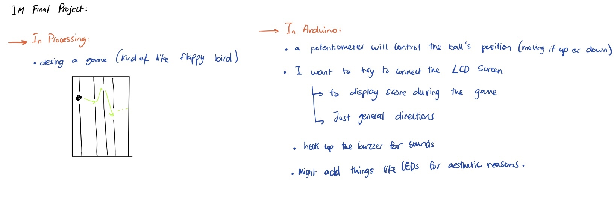

# Project Idea

I dont have the specifics of my project figured out yet, but I know that I want to use arduino to communicate to a game on processing. I want the communication to be both ways so that both arduino and processing are communicating with each other. The controls would be on arduino while feedback from the actual game would be communicated to different things connected to the arduino board. I was thinking of creating soemthing similar to the concept of flappy bird, or maybe even a musical instrument of sorts, but haven't really figured out the specifics yet...

