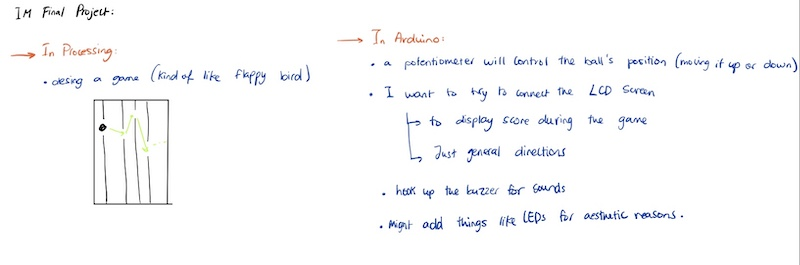

# Project Idea

I am still not 100% sure of the concept, but I saw that today's lesson will include talking about DC motors and that might be soemthing I am interested in using. The project does require a combination of both arduino and processing so I was thinking of maybe doing something with processing that would be reflected on arduino (for example a ball moves on processing and that makes a motor spin on arduino)... something along those lines.  The idea is still not clear so hopefully today's lesson will help me brainstorm a few more ideas for my project. 

