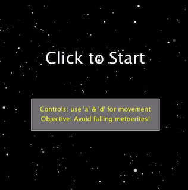
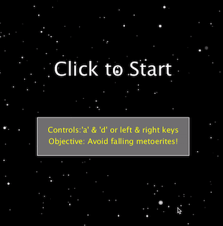
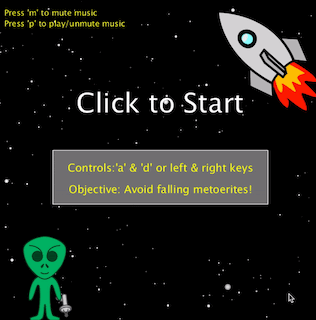

# Midterm Project

### Game Description & Instructions

### My Progress/ Different Game Stages

Refresh page if videos are not playing for some reason :)

#### Stage 1
- Attached below is a video of how I started my project. A plain black screen that transitioned into the game screen when the mouse was pressed. On the game screen was a simple spaceship design that was controlled by the position of mouseX.

#### Stage 2
- The next step was adding a space background that further enhanced the theme of the game. 
- I also created an array of meteorites to be falling from the sky, the only issue being that it would appear in the same place with the same size and speed over & over again. My goal was to have them appear randomly (in shape, size and position)

#### Stage 3
- I modified it so that the spaceship is being controlled by keys rather than the position of mouseX.
- The meteorites now fall from the sky at random positions with different sizes & speeds everytime
- At this stage, the game has no way to end or reach the game over screen.

#### Stage 4
- In this stage, I added barriers to prevent the spaceship from going off screen 
- I implemented collisions so that the game would end whenever a meteorite would hit the spaceship
- I added hearts on the screen (for game lives), but they don't work in this stage
- I also changed how the meteorites look.

#### Stage 5
- In this stage, the game lives work so you have 3 lives before the game is over. I added red flashed that appear on the screen to warn you that you have lost a life.
- I added SciFi background music and gave the player the choice to either mute or unmute it based on their preference. 
- I also added some images for design purposes

### Problems & Solutions
1) The first problem I had to deal with was the meteorites appearing in the same location with the same size and speed over and over again. To resolve that, I added an if statement that gave the meteorites a new location, size and speed everytime it was greater than the height.

2) Another thing I couldn't figure out was collisions. I did some research and was on the right path but I couldn't quite get there. I used the discord server to ask for help and a peer helped me realize what I was missing. I realized that I was using the right function (the dist function) but I had a crucial part missing. I was using an if statement and the dist function (dist between ship position and meteorite) but I was misusing the rational operator (less than). I mentioned a random number instead of mentioning the radius of the circle.

3) Before I implemented game lives, I ran into a glitch whenever the game was over. Rather than starting a new game once you have lost, the game continued from where it stopped previously. In this case the reason the game was lost was because the distance function I included made it so the game would end when the meteorite and the spaceship collided, so when the game continued and didn't have a fresh page, it started from that same spot that caused the game to stop. This caused the game to glitch and continously take you to the game over screen. To fix this issue, I created a reset game function that was called everytime the game over screen was reached. In it I was able to reset everything that needed to be reset (like meterorite positions) and that allowed for the game to continue seamlessly. 

4) The fourth issue I ran into was the game lives. I struggled with it a lot and almost considered changing it to a simpler scoreboard but I am glad I didn't because I quite like the way it turned out. The main issue was that instead of the game lives disappearing one by one, they would disappear all at once. I came to realize that the reason it was like this was because I was using multiple if statements that had similar conditions and that made them disappear at once. In order to fix this issue, I made it so I was using one main if statment followed by else if statements that made the game lives work more effectively. As well as fixing my mistakes with the statements, I made it so the meteorites would have a quick reset to the top of the screen as I noticed it made the system work more effeciently. 

4) 
